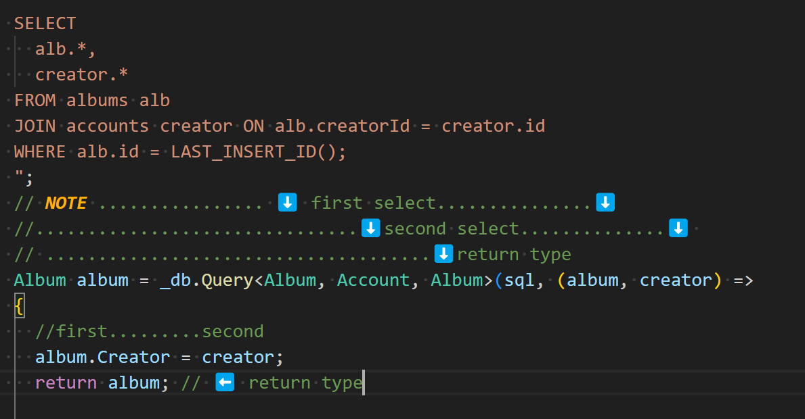

**POST IT - LECTURE - create dotnet vue - Change localhost in env to port 7045** 
  * dbSetup is for executing code to your db, your app does not communicate with that file.
  * **step 1** `create albums table` in dbSetup
    *  **note** - creatorId is a string in sql rather than the usual ObjectId in Node, datatypes have to match exactly if using multi table.
    * Use a `foreign Key restraint sql` this is not an sql version of virtuals, its simply tying two things together.
*     FOREIGN KEY (creatorId) REFERENCES accounts(id)
* you can add a `hook` to let it delete all of the referenced entries tied to that id, insert this after
*     FOREIGN KEY (creatorId) REFERENCES accounts(id) ON DELETE CASCADE
  * create an album table, again in dbsetup file to add it to the table.
* **step 2 - joining tables**
*     SELECT title, name FROM albums JOIN accounts;
  * more specific
*     SELECT title, 
      name
      FROM albums
      JOIN accounts ON albums.creatorId = accounts.id
      WHERE creator.id = "32423563276287";
**step 3 - create a model, repo, service and controller**
* create model, then repository, then service, followed by controller
* add services to `startup.cs` - repo and service
*     [HttpPost] // send Post request
      [Authorize] // This makes sure we are logged in
* **controller** `in controller` code create function `([FromBody], Album albumData)`
**Step 4 - make a request to Auth0**
  * public async
  * in the try catch v
  *     Account userInfo = await _auth.GetUserInfoAsync<Account>(HttpContext);
* Make sure you add Auth0Provider in dependancies
*     private readonly Auth0Provider _auth;
*     private readonly AlbumService _albumsService;
  * **note** any time we use an async request you have to use a `Task` type before the return type

**Step 4 - over to repo**
  * create dependancy
  *     private readonly IDbConnection _db;
  * this is where we create the sql string
*     string sql = @"
      INSERT INTO albums
      (tutke, category, coverImg, archived, creatorId VALUES)
      (@title, @category, @ccoverImg, @archived, @creatorId)
      SELECT 
      alb.*, 
      creator.*
      FROM albums alb
      JOIN accounts creator ON alb.creatorId = creator.id
      WHERE alb.id = LAST_INSERT_ID
      "
* code may be incorrect reference PostIt on codeworks repo 
* ID is the divider of tables
* **THIS IS SQL VERSION OF POPULTATING A CLASS IN JOINED TABLES**

